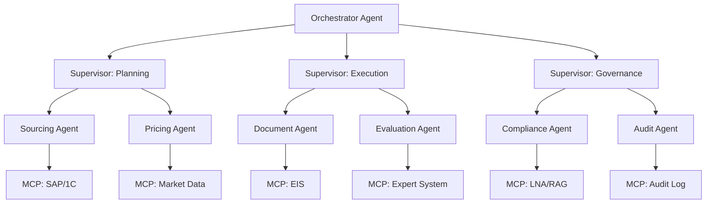
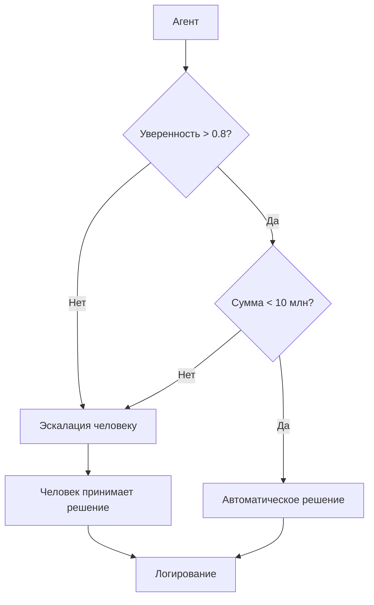
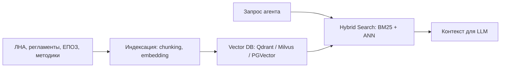
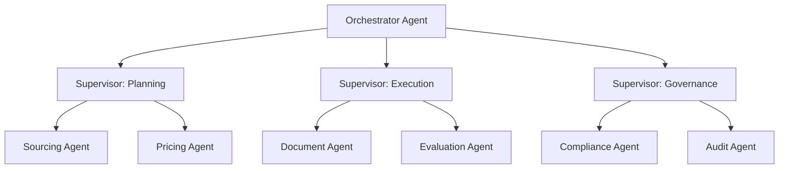
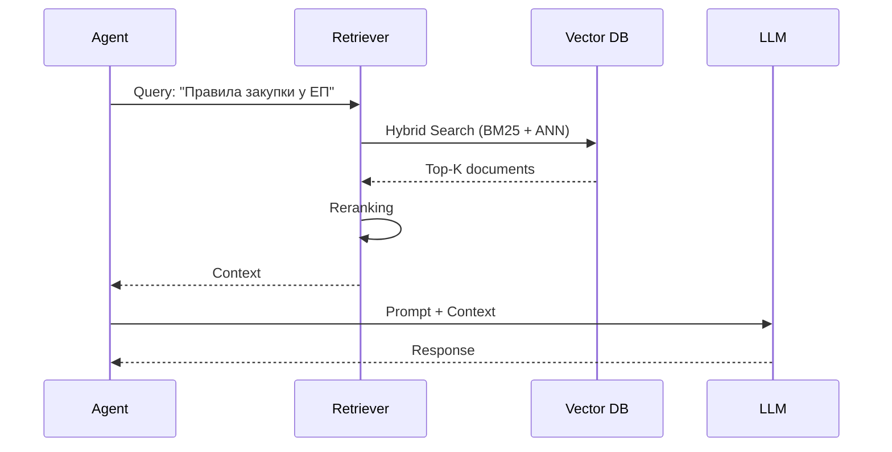
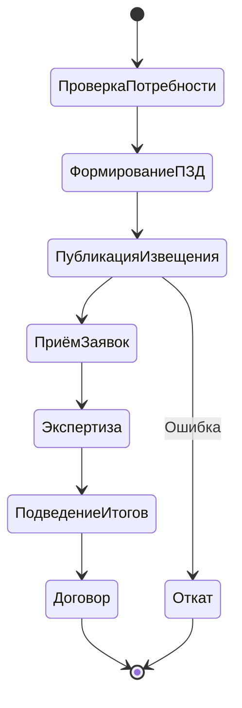

# Enterprise Agent Orchestration Blueprint

## Стратегия внедрения роя ИИ-агентов в закупочный цикл Заказчика

## Executive Summary

Крупные корпорации с территориально распределённой структурой и сложными закупочными процессами сталкиваются с фундаментальной проблемой: существующие автоматизированные системы управления закупками (АИСУЗ) перестали отвечать требованиям скорости, гибкости и масштабируемости. Монолитная архитектура, устаревшие технологии и невозможность быстрой адаптации под изменяющееся законодательство и локальные нормативные акты превращают систему из инструмента в тормоз.

Данный документ описывает архитектурный blueprint перехода от классической автоматизации к **оркестрации роя ИИ-агентов** — экосистемы автономных цифровых работников, каждый из которых специализирован на конкретном этапе закупочного цикла. В отличие от традиционной автоматизации, где система выполняет заранее запрограммированные сценарии, рой агентов способен к динамическому перераспределению задач, эскалации, самопроверке и адаптации к изменениям нормативной базы.

**Ключевые тезисы:**

- **Процессный охват:** 8 этапов закупочного цикла, 26 функциональных сервисов, 13 интеграционных потоков.
- **Экономический эффект:** высвобождение до 40% FTE на рутинных операциях (консервативная оценка, учитывающая реальную загрузку и перераспределение), при потенциале декомпозиции до 64% — в зависимости от полноты внедрения и зрелости процессов. Сокращение цикла закупки на 25–35%.
- **Безопасность:** модель WIMSE-совместимой идентичности агентов, полный аудит, Human-in-the-Loop на критических точках.
- **Развёртывание:** полностью в контуре Заказчика, без облачных решений, на отечественном стеке.

Документ предназначен для CTO, Head of Procurement и технических лидеров, принимающих решение о переходе к цифровому труду.


---

## Architecture Decision Records (ADR)

Этот blueprint оформлен как **Enterprise Architecture Reference Kit**. Ключевые архитектурные решения зафиксированы в формате ADR (Architecture Decision Records) по шаблону Michael Nygard.

| ADR | Название | Статус | Описание |
|-----|----------|--------|----------|
| [ADR-001](docs/adr/ADR-001-hybrid-orchestration.md) | Hybrid Orchestration Core | **Accepted** | Разделение ответственности: Camunda 8 (детерминированный BPMN) + LangGraph (семантические LLM-агенты). Policy Enforcement Point между ними. |
| [ADR-002](docs/adr/ADR-002-zero-trust-identity.md) | Zero-Trust Agent Identity & WIMSE | **Accepted** | SPIFFE/SPIRE для криптографической идентичности агентов, mTLS, RBAC + ABAC, append-only audit с hash-цепочкой. |
| [ADR-003](docs/adr/ADR-003-mcp-legacy.md) | MCP for Legacy Gateways | **Accepted** | Model Context Protocol как стандартизированный слой интеграции с 1С, ERP, ЕИС. MCP Gateway + ABAC-контроль на уровне атрибутов. |
| [ADR-004](docs/adr/ADR-004-observability-audit-cost.md) | Observability, Audit & Cost Boundary | **Accepted** | Единый trace_id (Jaeger), append-only audit с hash-цепочкой, LLM Router с российским On-Premise стеком (Qwen, YandexGPT, GigaChat) и квотированием в ₽. |

**Принципы ADR:**

- **Context** — почему возникла проблема.
- **Decision** — что решили.
- **Consequences** — что это даёт и какие риски.
- **Alternatives** — что рассматривали и почему отвергли.

Все ADR хранятся в [`docs/adr/`](docs/adr/).
---

## Часть I. Контекст и видение

### 1.1. Почему «рой агентов», а не «один агент»

Традиционный подход к автоматизации закупок предполагает создание монолитной системы, которая выполняет жёстко заданные сценарии. Такой подход хорошо работает, когда:
- Процессы стабильны.
- Нормативная база меняется редко.
- Объём закупок предсказуем.

Однако в реальности крупного холдинга:
- Локальные нормативные акты (ЛНА) обновляются ежеквартально, а иногда и ежемесячно.
- Количество способов закупки превышает 18 (конкурс, аукцион, запрос предложений, запрос котировок, закупка у ЕП, ВЗЛ, участие в закупках поставщика и т.д.).
- Территориальная распределённость означает, что одни и те же процессы выполняются в разных подразделениях с разными регламентами.

**Монолитная система не может адаптироваться с нужной скоростью.** Каждое изменение ЛНА требует доработки кода, тестирования, повторного развёртывания. Это занимает недели и месяцы.

**Рой агентов решает эту проблему иначе:**
- Каждый агент отвечает за узкую задачу (проверка заявки, расчёт НМЦ, формирование протокола).
- Изменение регламента → обновление политики агента (не кода всей системы).
- Агенты могут быть заменены, добавлены, переобучены независимо друг от друга.
- Оркестратор динамически перераспределяет задачи между агентами в зависимости от нагрузки и контекста.

Это переход от **автоматизации** (система выполняет то, что в неё заложили) к **автономности** (система сама определяет, как достичь цели в рамках политик).

### 1.2. Кейс-основа: закупочный цикл как полигон

В качестве полигона для внедрения роя агентов выбран закупочный цикл крупного энергетического холдинга. Этот выбор обоснован:

1. **Высокая степень регламентации.** Каждый шаг закупки описан в ЛНА, что создаёт чёткие границы для агентов.
2. **Большой объём рутинных операций.** Сбор данных, проверка документов, согласование, формирование отчётов — всё это может быть автоматизировано.
3. **Критичность ошибок.** Неправильный расчёт НМЦ или пропуск обязательного согласования ведёт к юридическим и финансовым рискам, что требует Human-in-the-Loop.
4. **Разнообразие сценариев.** 18+ способов закупки, разные уровни согласования (ЦЗК, ДЗ, ЕИО) — идеальная среда для мультиагентной системы.

### 1.3. Существующее положение

На момент старта проекта Заказчик использовал автоматизированную систему управления закупками на основе отечественной платформы. Система включала 26 функциональных сервисов, 13 интеграционных потоков и обслуживала более 70 справочников НСИ.

**Ключевые проблемы:**
- **Монолитная архитектура.** Изменение одного модуля требует переработки всей системы.
- **Устаревшие технологии.** Невозможность оперативной адаптации под изменяющиеся ЛНА и законодательство.
- **Использование иностранного ПО.** Что противоречит политике импортозамещения.
- **Низкая гибкость.** Каждая доработка требует 1+ человеко-месяц трудозатрат.

**Планируемая доработка** (в рамках инвестиционного проекта) предполагала изменение системной архитектуры, но всё ещё в парадигме монолита. Данный blueprint предлагает принципиально иной подход.

---

## Часть II. Карта цифрового труда

### 2.1. Декомпозиция закупочного цикла

Закупочный цикл Заказчика декомпозирован на 8 этапов, каждый из которых содержит набор задач, поддающихся автоматизации агентом.

| № | Этап | Ключевые задачи | Текущий % FTE |
|---|------|-----------------|---------------|
| 1 | Планирование потребности | Сбор потребностей, агрегация, лотирование, согласование | 15% |
| 2 | Планирование закупок | Формирование ГКПЗ, работа с ЦЗК, ДЗ, ЕИО | 12% |
| 3 | Подготовка к закупке | Формирование ПЗД, проверка комплектности | 18% |
| 4 | Проведение закупки | Работа с ЭТП, ЕИС, приём заявок, экспертиза | 20% |
| 5 | Экспертиза | Формирование индивидуальных и сводных заключений | 10% |
| 6 | Ценообразование | Расчёт НМЦ, проверка КЦД, экспертиза ПЦ | 8% |
| 7 | Договорная работа | Согласование договоров, работа с субподрядом | 10% |
| 8 | Аккредитация и жалобы | Проверка поставщиков, работа с жалобами ФАС | 7% |

**Итого:** 100% FTE распределено по 8 этапам.

### 2.2. Матрица «человек ↔ агент»

Для каждого этапа определены задачи, которые могут быть переданы агенту, и задачи, требующие обязательного участия человека.

#### Этап 1: Планирование потребности

| Задача | Агент | Человек | Обоснование |
|--------|-------|---------|-------------|
| Сбор потребностей из производственных систем | ✅ | | Интеграция с 1С, УИП, УПП |
| Проверка корректности номенклатуры | ✅ | | Сверка с ЕСУ НСИ |
| Агрегация потребностей | ✅ | | Алгоритм группировки |
| Лотирование | ✅ | | На основе исторических данных |
| Согласование лотов | | ✅ | Требуется решение ответственного лица |

#### Этап 2: Планирование закупок

| Задача | Агент | Человек | Обоснование |
|--------|-------|---------|-------------|
| Формирование проекта ГКПЗ | ✅ | | На основе потребностей |
| Проверка соответствия ЛНА | ✅ | | Сверка с актуальной версией положения |
| Подготовка обращения в ЦЗК | ✅ | | Формирование пакета документов |
| Принятие решения ЦЗК | | ✅ | Коллегиальный орган |
| Утверждение ЕИО | | ✅ | Единоличный исполнительный орган |

#### Этап 3: Подготовка к закупке

| Задача | Агент | Человек | Обоснование |
|--------|-------|---------|-------------|
| Формирование ПЗД | ✅ | | По шаблонам |
| Проверка комплектности | ✅ | | Чек-лист |
| Проверка актуальности шаблонов | ✅ | | Сверка с альбомом типовых форм |
| Утверждение ПЗД | | ✅ | Ответственное лицо |

#### Этап 4: Проведение закупки

| Задача | Агент | Человек | Обоснование |
|--------|-------|---------|-------------|
| Публикация извещения | ✅ | | Интеграция с ЕИС, ЭТП |
| Приём заявок | ✅ | | Автоматический сбор |
| Проверка соответствия заявок | ✅ | | По критериям |
| Ранжирование заявок | ✅ | | Алгоритм оценки |
| Принятие решения ЗК | | ✅ | Коллегиальный орган |

#### Этап 5: Экспертиза

| Задача | Агент | Человек | Обоснование |
|--------|-------|---------|-------------|
| Формирование индивидуальных заключений | ✅ | | По шаблонам |
| Формирование сводного заключения | ✅ | | Агрегация данных |
| Проверка на противоречия | ✅ | | Кросс-валидация |
| Подписание заключения | | ✅ | Эксперт |

#### Этап 6: Ценообразование

| Задача | Агент | Человек | Обоснование |
|--------|-------|---------|-------------|
| Сбор ценовой информации | ✅ | | Из открытых источников |
| Расчёт НМЦ | ✅ | | По методике |
| Проверка КЦД | ✅ | | Чек-лист |
| Экспертиза ПЦ | | ✅ | Требуется профессиональное суждение |

#### Этап 7: Договорная работа

| Задача | Агент | Человек | Обоснование |
|--------|-------|---------|-------------|
| Формирование проекта договора | ✅ | | По шаблону |
| Проверка субподрядчиков | ✅ | | Сверка с реестрами |
| Согласование договора | | ✅ | Юридическая служба |
| Подписание договора | | ✅ | Уполномоченное лицо |

#### Этап 8: Аккредитация и жалобы

| Задача | Агент | Человек | Обоснование |
|--------|-------|---------|-------------|
| Проверка заявки на аккредитацию | ✅ | | По чек-листу |
| Мониторинг статуса аккредитации | ✅ | | Автоматическое обновление |
| Обработка жалоб | ✅ | | Классификация, маршрутизация |
| Принятие решения по жалобе | | ✅ | Коллегиальный орган |

### 2.3. Типология агентов

На основе декомпозиции определены следующие типы агентов:

| Тип агента | Назначение | Примеры задач |
|------------|-----------|---------------|
| **Sourcing Agent** | Сбор и агрегация потребностей | Интеграция с производственными системами, проверка НСИ |
| **Planning Agent** | Формирование планов закупок | ГКПЗ, лотирование, проверка ЛНА |
| **Document Agent** | Формирование и проверка документов | ПЗД, проекты договоров, протоколы |
| **Compliance Agent** | Проверка соответствия | ЛНА, 223-ФЗ, ПП 301 |
| **Pricing Agent** | Расчёт и проверка цен | НМЦ, КЦД, анализ рынка |
| **Evaluation Agent** | Оценка заявок | Ранжирование, экспертиза |
| **Contract Agent** | Договорная работа | Проекты договоров, субподряд |
| **Accreditation Agent** | Аккредитация поставщиков | Проверка заявок, мониторинг |
| **Complaint Agent** | Работа с жалобами | Классификация, маршрутизация |
| **Orchestrator Agent** | Координация роя | Распределение задач, эскалация |

### 2.4. Экономический эффект

Расчёт высвобождения FTE по этапам:

| Этап | Текущий FTE | После внедрения | Высвобождение |
|------|-------------|-----------------|---------------|
| Планирование потребности | 15% | 5% | 10% |
| Планирование закупок | 12% | 4% | 8% |
| Подготовка к закупке | 18% | 6% | 12% |
| Проведение закупки | 20% | 10% | 10% |
| Экспертиза | 10% | 3% | 7% |
| Ценообразование | 8% | 2% | 6% |
| Договорная работа | 10% | 4% | 6% |
| Аккредитация и жалобы | 7% | 2% | 5% |
| **Итого** | **100%** | **36%** | **64%** |

**Примечание:** 64% — это теоретический максимум высвобождения, рассчитанный через декомпозицию задач. На практике часть высвобожденного времени уходит на:
- верификацию решений агентов (Human-in-the-Loop),
- обработку эскалаций,
- переобучение и настройку политик.

Поэтому **консервативная оценка для ROI — 35–40%**. Высвобождение FTE не означает сокращение персонала. Речь идёт о перераспределении ресурсов на более сложные задачи, требующие человеческого суждения.

---

## Часть III. Архитектура оркестрации

### 3.1. Общая схема

Архитектура роя агентов строится по принципу **иерархической оркестрации**:



**Уровни:**

1. **Orchestrator Agent** — единая точка входа для всех задач. Анализирует запрос, определяет тип, маршрутизирует к соответствующему Supervisor.
2. **Supervisor Agents** — управляют группой Worker Agents, следят за выполнением, обрабатывают ошибки, эскалируют.
3. **Worker Agents** — выполняют конкретные задачи (сбор данных, проверка, расчёт).

### 3.2. Протоколы A2A (Agent-to-Agent)

Взаимодействие между агентами строится на основе **контрактов** и **шин сообщений**.

#### 3.2.1. Контракты агентов

Каждый агент публикует свой контракт:

```yaml
agent_id: "pricing_agent_v1"
name: "Pricing Agent"
version: "1.0"
capabilities:
  - calculate_nmc
  - verify_price_documentation
  - analyze_market_prices
input_schema:
  type: object
  properties:
    lot_id: { type: string }
    methodology: { type: string, enum: ["method_1", "method_2"] }
output_schema:
  type: object
  properties:
    nmc_value: { type: number }
    justification: { type: string }
    confidence: { type: number, minimum: 0, maximum: 1 }
sla:
  max_execution_time: "30s"
  retry_policy: "3 attempts"
security:
  required_role: "pricing_agent"
  audit_level: "full"
```

#### 3.2.2. Шина сообщений

Для асинхронного взаимодействия используется **RabbitMQ** (уже присутствует в стеке Заказчика).

**Типы сообщений:**
- `task.request` — запрос на выполнение задачи.
- `task.response` — результат выполнения.
- `task.escalation` — эскалация на человека.
- `task.audit` — запись в аудит.

**Формат сообщения:**

```json
{
  "message_id": "uuid",
  "correlation_id": "uuid",
  "timestamp": "2025-05-15T10:00:00Z",
  "source_agent": "orchestrator",
  "target_agent": "pricing_agent",
  "type": "task.request",
  "payload": {
    "task_type": "calculate_nmc",
    "parameters": { ... }
  },
  "security_context": {
    "user_id": "ivanov",
    "role": "procurement_specialist",
    "session_id": "uuid"
  }
}
```

#### 3.2.3. Эскалация

Если агент не может выполнить задачу (недостаточно данных, низкая уверенность, конфликт политик), он инициирует эскалацию:

```json
{
  "type": "task.escalation",
  "reason": "low_confidence",
  "confidence": 0.45,
  "threshold": 0.8,
  "recommended_action": "human_review",
  "context": { ... }
}
```

Эскалация направляется Supervisor, который либо перенаправляет задачу другому агенту, либо передаёт человеку.

#### 3.2.4. Model Context Protocol (MCP) и фреймворки

Для стандартизации взаимодействия агентов с инструментами и legacy-системами используется **Model Context Protocol (MCP)**.

**MCP-серверы для legacy:**

```yaml
mcp_servers:
  - name: "eis_mcp_server"
    description: "Доступ к ЕИС"
    tools:
      - name: "publish_notice"
        input: { notice_data: object }
        output: { notice_id: string }
      - name: "get_notice_status"
        input: { notice_id: string }
        output: { status: string }
  
  - name: "sap_mcp_server"
    description: "Доступ к SAP"
    tools:
      - name: "get_contract"
        input: { contract_id: string }
        output: { contract_data: object }
```

**Фреймворки для оркестрации:**

| Фреймворк | Назначение | Применимость |
|-----------|------------|--------------|
| **LangGraph** | Графы состояний агентов | Пилот, гибкость |
| **CrewAI** | Ролевая модель агентов | Быстрый старт |
| **AutoGen** | Мультиагентные диалоги | Исследования |
| **Semantic Kernel** | Интеграция с .NET | Enterprise |
| **Кастомный** | Полный контроль | Долгосрочно |

**Рекомендация:** начать с **LangGraph** для пилота, затем — миграция на enterprise-решение (Temporal + кастомные агенты).

### 3.3. Human-in-the-Loop

Точки обязательного вмешательства человека определены на основе **критичности** и **риска**.

#### 3.3.1. Пороговые суммы

| Сумма закупки | Уровень контроля | Действие |
|---------------|------------------|----------|
| До 1 млн руб. | Автоматический | Агент принимает решение |
| 1–10 млн руб. | Выборочный | Агент + случайная проверка |
| 10–50 млн руб. | Обязательный | Агент + человек |
| Свыше 50 млн руб. | Коллегиальный | ЦЗК, ДЗ, ЕИО |

#### 3.3.2. Аномалии

Агент мониторинга аномалий отслеживает:
- Отклонение НМЦ от рыночной более чем на 20%.
- Единственный участник закупки.
- Повторяющиеся закупки у одного поставщика.
- Изменение условий договора после подписания.

При обнаружении аномалии — автоматическая эскалация.

#### 3.3.3. Юридические риски

Агент Compliance проверяет:
- Соответствие 223-ФЗ.
- Соответствие ПП 301 (закрытая часть ЕИС).
- Наличие обязательных согласований.
- Корректность шаблонов документов.

При выявлении несоответствия — блокировка и эскалация.



### 3.4. Интеграция с legacy

Система должна взаимодействовать с 13 внешними и внутренними системами.

#### 3.4.1. Паттерн адаптеров

Для каждой системы создаётся адаптер, который:
- Транслирует протоколы (SOAP → REST, JSON → XML).
- Обрабатывает ошибки.
- Логирует взаимодействие.

**Пример адаптера для ЕИС:**

```python
class EISAdapter:
    def __init__(self, config):
        self.endpoint = config['endpoint']
        self.certificate = config['certificate']
    
    def publish_notice(self, notice_data):
        """Публикация извещения в ЕИС"""
        # Трансформация в формат ЕИС
        eis_format = self._transform_to_eis(notice_data)
        # Отправка
        response = self._send_soap_request(eis_format)
        # Логирование
        self._log_interaction(notice_data, response)
        return response
    
    def _transform_to_eis(self, data):
        # Логика трансформации
        pass
```

#### 3.4.2. Интеграционная шина

Все интеграции проходят через **корпоративную шину данных**. Это обеспечивает:
- Единую точку контроля.
- Логирование всех потоков.
- Возможность мониторинга.

### 3.5. Наблюдаемость (Observability)

Для управления роем агентов необходима полная наблюдаемость.

#### 3.5.1. Трейсинг

Каждая задача получает **trace_id**, который передаётся между агентами. Это позволяет отследить полный путь задачи.

#### 3.5.2. Метрики

| Метрика | Описание | Целевое значение |
|---------|----------|------------------|
| Task Success Rate | Доля успешно выполненных задач | > 95% |
| Escalation Rate | Доля эскалаций | < 10% |
| Avg Execution Time | Среднее время выполнения | < 30 сек |
| Agent Availability | Доступность агентов | > 99.5% |
| Audit Completeness | Полнота аудита | 100% |

#### 3.5.3. Логирование

Все действия агентов логируются в формате, совместимом с **Process Mining**:

```json
{
  "process_id": "uuid",
  "event": "task_completed",
  "timestamp": "2025-05-15T10:00:00Z",
  "user_id": "agent_pricing_v1",
  "object_id": "lot_12345",
  "details": { ... }
}
```

### 3.6. LLM & Knowledge Architecture (RAG)

ИИ-агенты в системе не являются «чёрными ящиками» с жёстко зашитыми правилами. Они используют большие языковые модели (LLM) для анализа, генерации и принятия решений — но в строго ограниченном контуре.

#### 3.6.1. Развёртывание LLM

Все модели развёртываются **On-Premise**, без выхода данных за периметр Заказчика. Это требование ФСТЭК и политики импортозамещения.

**Варианты стека:**

| Компонент | Вариант A (Open-Source) | Вариант B (Проприетарный On-Prem) |
|-----------|-------------------------|-----------------------------------|
| Runtime | vLLM / Ollama | Проприетарный inference-сервер |
| Модели | DeepSeek, Qwen, Llama, Saiga | Лицензированные модели |
| Параметры | 32B–70B | По требованиям вендора |
| Хостинг | Kubernetes в контуре | Выделенные серверы |

**Критерии выбора:**
- Соответствие требованиям ФСТЭК.
- Возможность работы с русскоязычными документами (ЛНА, регламенты).
- Поддержка function calling / tool use для взаимодействия с legacy.
- Лицензионная чистота.

#### 3.6.2. База знаний (RAG)

Агенты работают с постоянно меняющимися ЛНА, регламентами и справочниками. Для этого используется **RAG (Retrieval-Augmented Generation)**.

**Архитектура:**



**Компоненты:**

| Компонент | Назначение |
|-----------|------------|
| Индексатор | Разбивка документов на чанки, генерация эмбеддингов |
| Vector DB | Хранение эмбеддингов (Qdrant, Milvus, PGVector) |
| Hybrid Search | Комбинация BM25 (точные совпадения) и ANN (семантический поиск) |
| Reranker | Переранжирование результатов для повышения точности |
| Context Builder | Формирование контекста для LLM с учётом лимитов окна |

**Пример запроса агента:**

```python
def get_context_for_task(task: Task) -> str:
    # 1. Формулировка запроса
    query = f"Правила {task.type} для {task.category} по 223-ФЗ"
    
    # 2. Hybrid search
    results = hybrid_search(
        query=query,
        vector_db="lna_index",
        top_k=10,
        alpha=0.5  # баланс BM25/ANN
    )
    
    # 3. Reranking
    reranked = rerank(results, query)
    
    # 4. Формирование контекста
    context = build_context(reranked, max_tokens=8000)
    
    return context
```

#### 3.6.3. Управление версиями ЛНА

ЛНА обновляются регулярно. Система должна:
- Автоматически отслеживать изменения.
- Переиндексировать затронутые документы.
- Уведомлять агентов об изменениях.
- Хранить историю версий для аудита.

**Механизм:**

```yaml
lna_update_pipeline:
  trigger: "new_version_detected"
  steps:
    - action: "fetch_new_version"
    - action: "diff_with_previous"
    - action: "reindex_changed_chunks"
    - action: "notify_affected_agents"
    - action: "log_change"
```

#### 3.6.4. Контекстное окно и стратегии

| Стратегия | Применение |
|-----------|------------|
| Sliding Window | Для длинных документов |
| Summarization | Для обзора нескольких ЛНА |
| Hierarchical Retrieval | Сначала разделы, потом детали |
| Caching | Кэширование частых запросов (Redis) |

#### 3.6.5. Безопасность LLM

- **Изоляция:** модели работают в отдельном сегменте сети.
- **Логирование:** все запросы и ответы логируются.
- **Фильтрация:** input/output фильтры для предотвращения утечек.
- **Rate limiting:** защита от злоупотреблений.

### 3.7. State Management и долгоживущие транзакции

Закупочный процесс может длиться неделями. Агенты должны сохранять состояние и корректно восстанавливаться после сбоев.

#### 3.7.1. Паттерн Saga

Для управления длительными процессами используется **Saga Pattern**:

```
┌─────────────────────────────────────────────────────────────┐
│                    Saga: Закупка лота                       │
├─────────────────────────────────────────────────────────────┤
│ 1. Проверка потребности        │ ✅ │ Компенсация: отмена   │
│ 2. Формирование ПЗД            │ ✅ │ Компенсация: удаление │
│ 3. Публикация извещения        │ ⏳ │ Компенсация: отзыв    │
│ 4. Приём заявок                │ ⏸️ │ Компенсация: —        │
│ 5. Экспертиза                  │ ⏸️ │ Компенсация: —        │
│ 6. Подведение итогов           │ ⏸️ │ Компенсация: —        │
│ 7. Договор                     │ ⏸️ │ Компенсация: —        │
└─────────────────────────────────────────────────────────────┘
```

Каждый шаг:
- Имеет компенсирующее действие.
- Сохраняет состояние в БД.
- Может быть повторён при сбое.

#### 3.7.2. Выбор технологии

| Вариант | Плюсы | Минусы |
|---------|-------|--------|
| **Temporal** | Надёжность, масштабируемость | Сложность развёртывания |
| **Camunda** | BPMN, интеграция | Тяжеловесность |
| **LangGraph** | Нативен для агентов | Молодой проект |
| **AutoGen** | Мультиагентность | Меньше контроля |
| **Кастомная реализация** | Полный контроль | Трудозатраты |

**Рекомендация:** для On-Premise развёртывания — **Temporal** или **Camunda** как проверенные enterprise-решения. LangGraph/AutoGen — для пилота.

#### 3.7.3. Обработка сбоев

```python
class AgentStateManager:
    def __init__(self, db, saga_id):
        self.db = db
        self.saga_id = saga_id
    
    def save_checkpoint(self, step, state):
        """Сохранение состояния после каждого шага"""
        self.db.save({
            "saga_id": self.saga_id,
            "step": step,
            "state": state,
            "timestamp": now()
        })
    
    def restore_from_checkpoint(self):
        """Восстановление после сбоя"""
        last = self.db.get_last_checkpoint(self.saga_id)
        return last.state
    
    def compensate(self, step):
        """Компенсация при откате"""
        action = COMPENSATION_MAP[step]
        action.execute()
```

---

## Часть IV. Governance и безопасность

### 4.1. Политики агентов

Каждый агент действует в рамках **политик**, которые определяют:

- **Что агент может делать** (allow-list действий).
- **Что агент не может делать** (deny-list).
- **Лимиты** (суммы, время, количество попыток).
- **Точки эскалации**.

**Пример политики для Pricing Agent:**

```yaml
policy_id: "pricing_agent_policy_v1"
agent_id: "pricing_agent_v1"
rules:
  - action: "calculate_nmc"
    allowed: true
    conditions:
      - "lot.amount <= 50000000"
      - "methodology in ['method_1', 'method_2']"
  - action: "approve_nmc"
    allowed: false
    reason: "Требуется утверждение человеком"
  - action: "access_market_data"
    allowed: true
    source: "approved_sources_only"
limits:
  max_execution_time: "30s"
  max_retries: 3
  max_amount: 50000000
escalation:
  - condition: "confidence < 0.8"
    action: "human_review"
  - condition: "amount > 10000000"
    action: "human_review"
```

### 4.2. Идентичность агентов

Для безопасного взаимодействия каждый агент имеет **уникальную идентичность**, основанную на принципах WIMSE (Workload Identity in Multi-System Environments).

#### 4.2.1. Компоненты идентичности

| Компонент | Описание |
|-----------|----------|
| Agent ID | Уникальный идентификатор агента |
| SPIFFE ID | `spiffe://test.ru/agents/pricing_agent_v1` |
| Сертификат | X.509, выданный внутренним CA |
| Роль | Набор разрешений |
| Срок действия | Краткосрочный (24 часа) |

#### 4.2.2. Взаимная аутентификация (mTLS)

Все взаимодействия между агентами происходят по **mTLS**. Это гарантирует:
- Аутентификацию обеих сторон.
- Шифрование трафика.
- Защиту от подмены.

#### 4.2.3. Краткосрочные токены

Агенты используют **краткосрочные токены** (JWT), которые:
- Выдаются на 1 час.
- Содержат роль и разрешения.
- Подписываются внутренним CA.
- Отзываются при компрометации.

### 4.3. Аудит и forensics

#### 4.3.1. Immutable log

Все действия агентов записываются в **неизменяемый журнал** (append-only). Это обеспечивает:
- Возможность восстановления полной картины.
- Соответствие требованиям регуляторов.
- Forensics при инцидентах.

**Структура записи:**

```json
{
  "audit_id": "uuid",
  "timestamp": "2025-05-15T10:00:00Z",
  "agent_id": "pricing_agent_v1",
  "action": "calculate_nmc",
  "input": { ... },
  "output": { ... },
  "decision": "approved",
  "confidence": 0.95,
  "escalated": false,
  "user_context": {
    "user_id": "ivanov",
    "role": "procurement_specialist"
  },
  "hash": "sha256:...",
  "previous_hash": "sha256:..."
}
```

#### 4.3.2. Replay действий

Для расследования инцидентов можно **воспроизвести** последовательность действий агента, используя журнал.

#### 4.3.3. Отчётность для регулятора

Система формирует отчёты:
- По каждой закупке — полный путь.
- По каждому агенту — статистика решений.
- По инцидентам — история и меры.

### 4.4. Соответствие требованиям

#### 4.4.1. 223-ФЗ

Агенты проверяют:
- Соблюдение сроков публикации.
- Корректность извещения.
- Наличие обязательных документов.

#### 4.4.2. ПП 301

Для заказчиков, попадающих под ПП 301:
- Данные, не подлежащие размещению в ЕИС, обрабатываются отдельно.
- Агент Compliance контролирует этот процесс.

#### 4.4.3. ГОСТ и ФСТЭК

Система соответствует:
- ГОСТ Р 59792-2021 (виды испытаний).
- Приказ ФСТЭК № 17 (защита информации).
- Класс защищённости не ниже К2.

### 4.5. Инцидент-менеджмент

#### 4.5.1. Kill-switch

Для каждого агента предусмотрен **kill-switch** — возможность мгновенной остановки.

**Сценарии:**
- Агент начал действовать неадекватно.
- Обнаружена компрометация.
- Критическая ошибка в политике.

#### 4.5.2. Деградация до «человек делает сам»

При отказе агента система переходит в режим **ручного управления**:
- Задачи перенаправляются человеку.
- Агент переводится в режим «только чтение».
- Инициируется расследование.

#### 4.5.3. План восстановления

1. Остановка агента.
2. Анализ причин.
3. Корректировка политики.
4. Тестирование в изолированной среде.
5. Постепенное возвращение в строй.

### 4.6. Risk Mitigation & Guardrails for LLM Agents

Переход к гибридной оркестрации (ADR-001) и WIMSE-идентичности (ADR-002) даёт enterprise-системе **адаптивность и безопасность**, но не отменяет **фундаментального свойства LLM: вероятностной природы**. Агент может:

- Галлюцинировать (выдать уверенный, но неверный ответ).
- Зациклиться (бесконечно вызывать инструменты без прогресса).
- Превысить полномочия (запросить действие вне своей роли).
- Быть скомпрометированным (prompt injection через входные данные).

Эта глава определяет **архитектурные границы (Guardrails)**, которые защищают систему от этих рисков. Guardrails — это **не «надежда на лучшее»**, а **инженерные решения**, встроенные в архитектуру.

---

#### 4.6.1. Boundary Rules: детерминированный BPMN vs семантический Agent

**Принцип:** не отдавать LLM бинарные, финансовые и юридические решения.

| Тип решения | Кто принимает | Обоснование |
|-------------|---------------|-------------|
| **Одобрение закупки** (approved = true/false) | XOR Gateway или человек | Бинарное решение с финансовыми последствиями |
| **Подписание договора** | Уполномоченное лицо | Юридическая ответственность |
| **Расчёт НМЦ** | LLM-агент (рекомендация) + человек (утверждение) | Агент готовит расчёт, человек утверждает |
| **Классификация обращения** | LLM-агент | Семантическая задача, низкий риск |
| **Формирование черновика письма** | LLM-агент | Творческая задача, человек проверяет |
| **Поиск похожих кейсов (RAG)** | LLM-агент | Информационная задача, не создаёт обязательств |

**Правило:** LLM **рекомендует**, BPMN **решает**. Агент формирует `RecommendationDTO`, но **не вызывает** бизнес-функции напрямую.

---

#### 4.6.2. Policy Enforcement Point (PEP)

Агент **не имеет прямого доступа** к бизнес-функциям. Он формирует `RecommendationDTO`, который проходит через **PEP** в BPMN-слое:

```
Агент → RecommendationDTO → PEP → (ALLOW / DENY)
                              │
                              ├── ALLOW → вызов целевого воркера
                              └── DENY  → BPMN Error → эскалация
```

**Проверки в PEP:**

1. **SVID агента** — есть ли у него право обращаться к PEP? (WIMSE, ADR-002)
2. **RBAC** — разрешена ли роль агента для этого действия?
3. **ABAC** — разрешено ли действие с этими атрибутами (сумма, регион, категория)?
4. **Confidence threshold** — достаточно ли уверен агент для автономии?
5. **Tool allow-list** — разрешён ли запрошенный инструмент?
6. **Audit log** — запись с SVID, reasoning, decision (append-only, hash-цепочка).

**Если хоть одна проверка не пройдена** → `BPMN Error` → Boundary Event → User Task «Эскалация».

Это реализация принципа наименьших привилегий (Least Privilege).

---

#### 4.6.3. Dynamic Escalation Matrix

Ключевой инструмент защиты — **пороги уверенности (confidence thresholds)**, связанные с финансовым риском.

| Уровень риска | Confidence | Сумма закупки | Действие |
|---------------|------------|---------------|----------|
| **Низкий** | ≥ 0.95 | < 1 млн руб. | Автономно (агент) |
| **Средний** | ≥ 0.85 | 1–10 млн руб. | Автономно + выборочная проверка (10% случаев) |
| **Высокий** | ≥ 0.85 | 10–50 млн руб. | Агент + обязательное утверждение человеком |
| **Критический** | ≥ 0.85 | > 50 млн руб. | Агент + коллегиальный орган (ЦЗК, ДЗ, ЕИО) |
| **Неопределённость** | < 0.85 | любая | Эскалация на человека (независимо от суммы) |

**Правило:** **всегда побеждает более строгий уровень.** Если confidence = 0.90, но сумма = 60 млн — решение идёт к коллегиальному органу, а не автономно.

**Где хранится:** матрица реализуется в `evaluate_policy()` (PEP) как набор правил OPA/Rego или Cedar. Изменение порогов — обновление политики, а не кода.

---

#### 4.6.4. Execution Safeguards

LLM-агент работает в **BPMN-шаге**, поэтому все защитные механизмы **уже есть** в Camunda 8:

| Риск | Механизм защиты | Реализация в Camunda |
|------|-----------------|----------------------|
| **Бесконечный цикл** | `max_iterations` в agent runtime | Ограничение количества tool calls в одном шаге |
| **Зависание** | Execution timeout | Boundary Timer Event на Service Task (например, 60 сек) |
| **Каскадный сбой** | Circuit Breaker | Retry policy + Fallback на другого агента |
| **Превышение полномочий** | PEP + RBAC | Проверка `RecommendationDTO` перед вызовом |
| **Галлюцинации** | Confidence threshold | `confidence < 0.85` → эскалация |
| **Prompt Injection** | Input sanitization + Guardrails | Фильтрация входных данных перед LLM |
| **Утечка данных** | Output filtering | Проверка ответа LLM на PII/секреты |

**Ключевое:** **все эти механизмы встроены в BPMN-слой**, а не в код агента. Это значит:
- Их можно **настроить** через Web Modeler.
- Они **аудируются** через Operate.
- Они **единообразны** для всех агентов.

---

#### 4.6.5. Anti-Patterns & Operational Limits

**Что НЕ делать:**

- ❌ **Давать агенту транзакционные решения** (оплата, подписание, списание). Это всегда — за человеком или детерминированным BPMN.
- ❌ **Давать агенту прямой доступ к legacy-системам** (1С, ERP). Только через MCP + PEP.
- ❌ **Запускать агента без `max_iterations` и таймаутов.** Бесконечный цикл — реальная проблема ReAct-агентов.
- ❌ **Использовать LLM там, где достаточно чётких правил.** `if amount > 1_000_000` не нуждается в LLM.
- ❌ **Игнорировать confidence threshold.** «Агент всегда прав» — путь к инцидентам.
- ❌ **Отсутствие аудита.** Без audit log невозможно расследовать инцидент.
- ❌ **Жёсткие политики без возможности обновления.** ЛНА меняются — политики должны меняться.

**Operational Limits:**

- **Max iterations per step:** 5 (после — эскалация).
- **Max execution time per step:** 60 сек.
- **Max tokens per request:** 8000 (ограничение контекста).
- **Max cost per process instance:** задаётся на уровне тенанта.
- **Max escalation rate:** если > 20% задач эскалируются — сигнал, что агент не справляется.

---

#### 4.6.6. Мониторинг и алерты

Guardrails работают только если за ними **наблюдают**. Метрики для мониторинга:

| Метрика | Целевое значение | Алерт при |
|---------|------------------|-----------|
| **Policy Deny Rate** | < 5% | > 10% (агент пытается делать недопустимое) |
| **Escalation Rate** | < 10% | > 20% (агент не уверен) |
| **Avg Confidence** | > 0.85 | < 0.75 (качество агента падает) |
| **Max Iterations Hit** | < 1% | > 5% (агент зацикливается) |
| **Avg Execution Time** | < 30 сек | > 45 сек (деградация latency) |
| **Audit Gap** | 0 | > 0 (нарушение аудита — критично) |

Все метрики экспортируются в **Langfuse + Prometheus** (ADR-004) и отображаются в **Grafana**.

---

#### 4.6.7. Связь с ADR

| ADR | Что покрывает | Как связано с 4.6 |
|-----|---------------|-------------------|
| **ADR-001** | Hybrid Orchestration Core | Определяет границу BPMN ↔ Agent |
| **ADR-002** | Zero-Trust Identity & WIMSE | SVID, RBAC, ABAC в PEP |
| **ADR-003** | MCP for Legacy Gateways | Изоляция legacy через MCP + ABAC |
| **ADR-004** | Observability, Audit & Cost | Метрики для мониторинга Guardrails |

**Итог:** Guardrails — это **не отдельная система**, а **композиция архитектурных решений** из ADR-001…004, применённых к конкретному риску (вероятностной природе LLM).

---

## Часть V. Внедрение и экономика

### 5.1. Дорожная карта

| Этап | Срок | Содержание |
|------|------|------------|
| **Пилот** | 0–3 мес. | Внедрение 2–3 агентов (Sourcing, Document) на одном процессе |
| **Расширение** | 3–9 мес. | Добавление агентов Pricing, Compliance, Evaluation |
| **Масштабирование** | 9–18 мес. | Полный рой агентов, интеграция со всеми системами |
| **Оптимизация** | 18–24 мес. | Настройка политик, обучение, снижение эскалаций |

### 5.2. Команда

| Роль | Ответственность |
|------|-----------------|
| **Agent Ops Lead** | Управление жизненным циклом агентов |
| **AI Governance Lead** | Политики, безопасность, аудит |
| **Process Owner** | Соответствие бизнес-процессам |
| **ML Engineer** | Обучение и настройка агентов |
| **Security Engineer** | Идентичность, mTLS, аудит |
| **Integration Engineer** | Адаптеры, шина данных |

### 5.3. ROI-модель

| Показатель | Значение |
|------------|----------|
| Высвобождение FTE (консервативно) | 35–40% |
| Потенциал декомпозиции | до 64% |
| Сокращение цикла закупки | 25–35% |
| Снижение ошибок | 40–50% |
| Экономия на рутинных операциях | 15–20 млн руб./год |
| Стоимость внедрения | 30–40 млн руб. |
| Срок окупаемости | 18–24 мес. |

### 5.4. Риски и антипаттерны

| Риск | Митигация |
|------|-----------|
| Сопротивление персонала | Обучение, перераспределение ролей |
| Ошибки агентов | Human-in-the-Loop, аудит |
| Компрометация | mTLS, краткосрочные токены, kill-switch |
| Несоответствие ЛНА | Регулярное обновление политик |
| Избыточная сложность | Постепенное внедрение, пилоты |

**Антипаттерны:**
- Попытка автоматизировать всё сразу.
- Игнорирование Human-in-the-Loop.
- Отсутствие аудита.
- Жёсткие политики без возможности обновления.

---

## Часть VI. Приложения

### Приложение A. Глоссарий

| Термин | Определение |
|--------|-------------|
| A2A | Agent-to-Agent взаимодействие |
| Human-in-the-Loop | Точка обязательного вмешательства человека |
| WIMSE | Workload Identity in Multi-System Environments |
| Orchestrator | Координирующий агент |
| Supervisor | Управляющий агент |
| Worker | Исполняющий агент |
| MCP | Model Context Protocol |
| RAG | Retrieval-Augmented Generation |
| Saga | Паттерн управления длительными транзакциями |

### Приложение B. Ссылки на паттерны

- **SPIFFE/SPIRE** — идентичность рабочих нагрузок.
- **mTLS** — взаимная аутентификация.
- **Process Mining** — анализ процессов.
- **RabbitMQ** — шина сообщений.
- **Redis** — кэширование.
- **Temporal / Camunda** — управление долгоживущими транзакциями.
- **LangGraph / CrewAI / AutoGen** — фреймворки для мультиагентных систем.

### Приложение C. Шаблоны политик

Шаблоны политик для каждого типа агента доступны в репозитории.

### Приложение D. Диаграммы

Все диаграммы внедрены в тело документа в формате Mermaid и рендерятся на GitHub нативно.

#### Диаграмма 1: Общая архитектура



#### Диаграмма 2: RAG-пайплайн



#### Диаграмма 3: Saga-транзакция



#### Диаграмма 4: Human-in-the-Loop


---

## Заключение

Переход к оркестрации роя ИИ-агентов — это не просто технологическое обновление. Это смена парадигмы: от автоматизации, где система выполняет заранее заданные сценарии, к автономности, где система сама определяет, как достичь цели в рамках политик.

Для Заказчика со сложными закупочными процессами это означает:
- **Скорость:** адаптация к изменениям ЛНА за дни, а не месяцы.
- **Масштабируемость:** добавление новых агентов без переработки всей системы.
- **Прозрачность:** полный аудит каждого действия.
- **Безопасность:** WIMSE-совместимая идентичность, mTLS, kill-switch.
