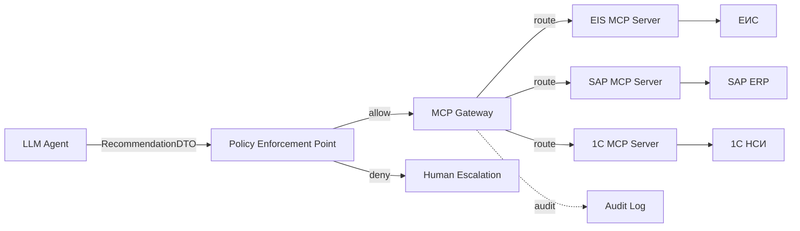

# ADR-003: Model Context Protocol (MCP) for Legacy Gateways

## Status

**Proposed** — 2026-09-15

## Context

Гибридная оркестрация (ADR-001) предполагает, что LLM-агенты
выполняют семантическую работу и **вызывают корпоративные функции**:

- Публикация извещения в ЕИС.
- Получение данных контракта из SAP.
- Работа с НСИ в 1С.
- Проверка аккредитации поставщика на портале.

Закупочный цикл Заказчика включает **13 интеграционных потоков**
с внешними и внутренними системами:

| № | Система | Тип | Протокол |
|---|---------|-----|----------|
| 1 | ОСРГ (торговая площадка) | Внешняя | REST/SOAP |
| 2 | Аккредитация поставщиков | Внешняя | REST |
| 3 | ЭТП (РАД, ЕЭТП) | Внешняя | SOAP |
| 4 | ЕИС | Внешняя | SOAP |
| 5 | ERP (1С ФЭУ) | Внутренняя | REST/OData |
| 6 | MDM (ЕСУ НСИ) | Внутренняя | REST |
| 7 | Служба каталогов (AD/ALD Pro) | Внутренняя | LDAP/Kerberos |
| 8 | LanDocs | Внутренняя | SOAP |
| 9 | Documino | Внутренняя | REST |
| 10 | 1С КЭДО | Внутренняя | REST |
| 11 | Озеро данных | Внутренняя | SQL/REST |
| 12 | ИСУП/1С ЗУП | Внутренняя | REST/OData |
| 13 | УИП/УПП/УФАП/КИПР | Внутренняя | Разные |

**Проблемы при прямом доступе агента к legacy:**

1. **Разные протоколы.** Агент должен знать SOAP, REST, OData, LDAP —
   это не задача LLM.

2. **Разные модели безопасности.** Каждая система имеет свой способ
   аутентификации (API key, OAuth, mTLS, Kerberos). Агент не должен
   управлять 13 разными credentials.

3. **Утечка данных.** Прямой доступ агента к API означает, что
   LLM видит «сырые» данные. Это риск утечки PII/секретов.

4. **Нет единого аудита.** Логи разбросаны по 13 системам.
   Невозможно отследить полный путь задачи.

5. **Хрупкость интеграций.** Изменение API в legacy-системе
   ломает всех агентов, которые её используют.

6. **Prompt Injection.** Если legacy-система возвращает
   необработанные данные, они попадают в промпт LLM. Это вектор атаки.

7. **Отсутствие стандарта.** Каждый агент интегрируется со своей
   системой по-своему. Нет единого контракта.

Существующие подходы (прямые API-вызовы, ESB, custom adapters)
не решают эти проблемы системно.

## Decision

Принимаем **Model Context Protocol (MCP)** как **стандартизированный
слой интеграции** между LLM-агентами и legacy-системами.

### 1. MCP-сервер для каждой legacy-системы

Каждая legacy-система оборачивается в **MCP-сервер** с типизированными
tools:

```yaml
mcp_servers:
  - name: "eis_mcp_server"
    description: "Доступ к ЕИС (Единая информационная система)"
    version: "1.0"
    tools:
      - name: "publish_notice"
        description: "Публикация извещения о закупке"
        input_schema:
          type: object
          properties:
            lot_id: { type: string }
            notice_data: { type: object }
          required: [lot_id, notice_data]
        output_schema:
          type: object
          properties:
            notice_id: { type: string }
            published_at: { type: string, format: date-time }
        abac:
          required_role: "document_agent"
          max_amount: 50000000
          allowed_regions: ["Moscow", "SPb"]

      - name: "get_notice_status"
        description: "Получить статус извещения"
        input_schema:
          type: object
          properties:
            notice_id: { type: string }
          required: [notice_id]
        output_schema:
          type: object
          properties:
            status: { type: string, enum: ["draft", "published", "closed"] }

  - name: "sap_mcp_server"
    description: "Доступ к SAP ERP"
    tools:
      - name: "get_contract"
        input_schema:
          type: object
          properties:
            contract_id: { type: string }
          required: [contract_id]
        output_schema:
          type: object
          properties:
            contract_data: { type: object }
        abac:
          required_role: "contract_agent"

  - name: "1c_mcp_server"
    description: "Доступ к 1С (НСИ, производственные данные)"
    tools:
      - name: "get_nomenclature"
        input_schema:
          type: object
          properties:
            code: { type: string }
          required: [code]
        output_schema:
          type: object
          properties:
            name: { type: string }
            category: { type: string }
            unit: { type: string }
```

**Контракт MCP-сервера:**

- **Input schema** — что агент должен передать (JSON Schema).
- **Output schema** — что агент получит (JSON Schema).
- **ABAC** — атрибуты, при которых вызов разрешён.
- **Description** — описание на естественном языке (для LLM).

### 2. MCP Gateway

Все MCP-серверы объединяются в **MCP Gateway** — единую точку
входа для агентов:

```
Агент → MCP Gateway → (маршрутизация) → MCP Server → Legacy System
                │
                ├── Проверка SVID (ADR-002)
                ├── Проверка ABAC
                ├── Audit logging
                └── Rate limiting
```

**Функции MCP Gateway:**

- **Discovery:** агент видит каталог доступных tools.
- **Маршрутизация:** запрос направляется в нужный MCP-сервер.
- **Policy Enforcement:** SVID, RBAC, ABAC — до вызова legacy.
- **Audit:** каждое обращение логируется.
- **Rate limiting:** защита legacy от перегрузки.

### 3. ABAC на уровне атрибутов

Вместо грубого «доступ к ЕИС» — **fine-grained контроль**:

```rego
# OPA/Rego policy для publish_notice
package mcp.eis

default allow = false

allow {
    input.agent_svid == "spiffe://company.ru/agents/document_agent_v1"
    input.tool_name == "publish_notice"
    input.parameters.lot.amount <= 50000000
    input.parameters.lot.region in ["Moscow", "SPb"]
    input.parameters.notice_data.version == "latest"
}
```

**Что это даёт:**

- Document Agent может публиковать извещения **только для лотов
  с суммой ≤ 50 млн** в **Москве и СПб**.
- Для других регионов или сумм → эскалация на человека.

Политики хранятся **отдельно от кода** (OPA/Rego), обновляются
без релиза агентов.

### 4. Аудит каждого MCP-вызова

Каждый вызов MCP-сервера логируется в **append-only audit log**:

```json
{
  "timestamp": "2026-09-15T10:00:00Z",
  "trace_id": "uuid",
  "agent_svid": "spiffe://company.ru/agents/document_agent_v1",
  "mcp_server": "eis_mcp_server",
  "tool_name": "publish_notice",
  "input": {
    "lot_id": "lot_12345",
    "notice_data": { "version": "latest" }
  },
  "output": {
    "notice_id": "notice_67890",
    "published_at": "2026-09-15T10:00:00Z"
  },
  "decision": "allow",
  "abac_rules_matched": ["amount_ok", "region_ok"],
  "latency_ms": 234,
  "hash": "sha256:...",
  "previous_hash": "sha256:..."
}
```

Hash-цепочка делает лог **tamper-evident** (см. ADR-002).

### 5. Обработка ошибок и деградация

MCP Gateway реализует **Saga-паттерн** для вызовов legacy:

| Сценарий | Действие |
|----------|----------|
| **Legacy недоступна (timeout)** | Retry (3 попытки) → Circuit Breaker → fallback на человека |
| **ABAC запрещает** | BPMN Error → эскалация на человека |
| **MCP-сервер вернул ошибку** | Логирование + retry → эскалация |
| **Legacy вернула неожиданные данные** | Валидация по output_schema → если невалидно, эскалация |
| **Prompt Injection через legacy** | Sanitization output → фильтрация PII/секретов |

**Ключевое:** **все ошибки обрабатываются в BPMN-слое** (ADR-001),
не в агенте. Это даёт retry, timeout, audit — из коробки.

### 6. Схема взаимодействия



## Consequences

### Положительные

- **Единый контракт:** агент видит tools через MCP, не зная
  про протоколы legacy.
- **Безопасность:** ABAC на уровне атрибутов, SVID-валидация,
  append-only audit.
- **Масштабируемость:** новый MCP-сервер = новый источник данных
  без переписывания агентов.
- **Аудит:** все вызовы логируются в единый контур.
- **Устойчивость:** retry, circuit breaker, fallback на человека —
  в BPMN-слое.
- **Изоляция:** агент не видит «сырые» данные legacy, только
  типизированные ответы.
- **Prompt Injection Protection:** sanitization на уровне
  MCP Gateway.

### Отрицательные / Риски

- **Latency:** MCP Gateway + MCP Server + Legacy = 3 hops вместо 1.
- **Сложность:** нужен отдельный слой (Gateway + N серверов).
- **Обучение команды:** MCP — молодой протокол, мало экспертизы.
- **Стоимость:** разработка MCP-серверов для 13 систем — это
  отдельный проект.
- **Зрелость:** MCP — стандарт от Anthropic (2024), ещё не
  прошёл проверку временем в enterprise.

### Митигации

- **Latency:** кэширование частых запросов (Redis), connection
  pooling, batch-запросы.
- **Сложность:** начать с 2–3 MCP-серверов (ЕИС, SAP, 1С),
  остальные — итеративно.
- **Обучение:** внутренние workshop, документация, runbook.
- **Стоимость:** MCP-серверы можно разрабатывать параллельно
  с другими задачами, не блокируя пилот.
- **Зрелость:** MCP основан на JSON-RPC 2.0, легко мигрировать
  на собственный протокол, если MCP не выстрелит.

## Alternatives Considered

### Альтернатива 1: Прямые API-вызовы из агента

**Плюсы:** простота, нет дополнительного слоя.

**Минусы:**
- Агент должен знать протоколы (SOAP, REST, OData).
- Credentials 13 систем в одном месте.
- Нет единого аудита.
- Prompt Injection через legacy-ответы.
- Изменение API ломает агентов.

**Отвергнуто:** нарушает Least Privilege, не масштабируется.

### Альтернатива 2: ESB / Корпоративная шина данных

**Плюсы:** зрелое решение, есть в инфраструктуре Заказчика.

**Минусы:**
- Тяжёлая, не адаптирована под LLM-агентов.
- Нет типизированных contracts для tools.
- Нет SVID/ABAC на уровне атрибутов.
- Сложно эволюционировать под новые сценарии.

**Отвергнуто:** ESB — это транспорт, MCP — это контракт.
Можно использовать **вместе** (MCP Gateway поверх ESB).

### Альтернатива 3: Custom Adapters (по одному на систему)

**Плюсы:** полный контроль, можно адаптировать под специфику.

**Минусы:**
- N адаптеров = N кодовых баз.
- Нет стандарта для tools.
- Дублирование логики (retry, audit, auth).
- Сложно поддерживать.

**Отвергнуто:** изобретение велосипеда. MCP даёт стандарт.

### Альтернатива 4: GraphQL Federation

**Плюсы:** единая схема, типизированные запросы.

**Минусы:**
- Ориентирован на UI-сценарии, не на LLM-агентов.
- Нет tool calling из коробки.
- Нет интеграции с SVID/SPIFFE.
- Сложнее в настройке для legacy.

**Отвергнуто:** GraphQL — для чтения данных, MCP — для
действий (tool calling). Можно использовать **вместе** для
read-heavy сценариев.

### Альтернатива 5: LangChain Tools (без MCP)

**Плюсы:** нативная интеграция с LangGraph (ADR-001).

**Минусы:**
- Tools живут в коде агента, а не в отдельном слое.
- Нет единой точки контроля (audit, ABAC).
- Обновление tool = релиз агента.
- Нет переиспользования между агентами.

**Отвергнуто:** LangChain Tools — это удобно, но небезопасно
для enterprise. MCP даёт **внешний слой** с контрактами.

## References

- MCP Specification: https://spec.modelcontextprotocol.io/
- MCP Documentation: https://modelcontextprotocol.io/
- JSON-RPC 2.0: https://www.jsonrpc.org/specification
- OPA/Rego: https://www.openpolicyagent.org/docs/latest/policy-language/
- Enterprise Agent Orchestration Blueprint, раздел 3.4 (Legacy Integration)
- ADR-001: Hybrid Orchestration Core
- ADR-002: Zero-Trust Agent Identity & WIMSE
- ADR-004: Observability, Audit & Cost Boundary
