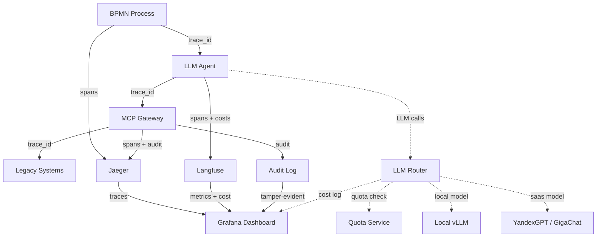

# ADR-004: Observability, Audit & Cost Boundary

## Context

Гибридная оркестрация (ADR-001), WIMSE-идентичность (ADR-002) и
MCP-интеграция с legacy (ADR-003) создают распределённую систему,
где одна бизнес-задача проходит через:

- BPMN-процесс (Camunda 8).
- LLM-агента (LangGraph).
- Policy Enforcement Point.
- MCP Gateway.
- N legacy-систем (ЕИС, SAP, 1С, ...).

**Проблемы, которые это создаёт:**

### 1. Observability

Одна задача распределена по 5+ компонентам. Без единого контура
трейсинга **невозможно понять**, где произошёл сбой:

- BPMN-шаг завис на 30 секунд — это LLM или legacy?
- Агент вернул confidence = 0.6 — это норма или деградация?
- MCP-вызов занял 5 секунд — это SAP или сеть?

Логи разбросаны:
- Camunda Operate — BPMN-события.
- Langfuse — LLM-трейсы.
- MCP Gateway — вызовы legacy.
- SPIRE — SVID-события.

**Без единого trace_id** — это **невозможно связать**.

### 2. Audit

Регуляторные требования (ФСТЭК, 223-ФЗ, ПП 301) требуют:

- Полный путь каждой закупки.
- Каждое действие агента с обоснованием.
- Защита лога от подмены (tamper-evident).
- Возможность forensics при инциденте.

**Append-only лог** — обязателен, но недостаточен:
- Нужна **hash-цепочка** (как в ADR-002).
- Нужна **возможность replay** действий.
- Нужны **отчёты для регулятора**.

### 3. Cost Boundary

LLM-вызовы **дорогие**, и в контуре Заказчика есть **три ограничения**:

1. **Внешние API (OpenAI, Anthropic, Groq) недоступны** по требованиям
   импортозамещения и ФСТЭК.
2. **Оплата в валюте невозможна** — только рубли, только контракты
   с российскими провайдерами.
3. **Данные ограниченного доступа (ПДн, коммерческая тайна)**
   не могут покидать периметр Заказчика.

Без контроля расходы растут неконтролируемо. Нет **квотирования**
по подразделениям. Нет **маршрутизации** на дешёвые локальные модели.

**FinOps для LLM** — новая дисциплина, требующая архитектурных
решений.

## Decision

Принимаем **трёхслойную модель** для observability, audit и
cost boundary.

### 1. Observability: единый trace_id + Langfuse + Jaeger

**Ключевой принцип:** **один trace_id на весь путь задачи.**

Каждый BPMN-процесс генерирует `trace_id` при старте.
Он передаётся через:

- BPMN variables (`trace_id`).
- LLM-агента (передаётся в prompt и в Langfuse metadata).
- MCP Gateway (заголовок `X-Trace-Id` в JSON-RPC).
- Legacy-системы (заголовок `X-Trace-Id` в HTTP/SOAP).

**Стек observability:**

| Компонент | Назначение | Что покрывает |
|-----------|-----------|---------------|
| **Camunda Operate** | BPMN-события, переменные, инциденты | BPMN-слой |
| **Langfuse** | LLM-трейсы, промпты, токены, стоимость | Agent-слой |
| **Jaeger** | Распределённый трейсинг (OpenTelemetry) | Все слои |
| **Prometheus + Grafana** | Метрики (latency, throughput, errors) | Инфраструктура |
| **MCP Gateway logs** | Вызовы legacy (tool, input, output) | MCP-слой |

**Связка:** все компоненты отправляют спаны в **Jaeger** с общим
`trace_id`. В UI Jaeger видно **полный путь задачи** от BPMN-шага
до legacy-ответа.

**Пример спана:**

```json
{
  "trace_id": "abc123",
  "span_id": "def456",
  "parent_span_id": "xyz789",
  "operation": "mcp.eis.publish_notice",
  "start_time": "2026-09-15T10:00:00Z",
  "duration_ms": 234,
  "tags": {
    "agent_svid": "spiffe://company.ru/agents/document_agent_v1",
    "bpmn_process_id": "Process_1jm40gc",
    "bpmn_step": "Activity_0vwwiy0",
    "legacy_system": "EIS",
    "tool_name": "publish_notice"
  }
}
```

### 2. Audit: append-only + hash-цепочка + replay

**Append-only audit log** с hash-цепочкой (реализация ADR-002):

```json
{
  "audit_id": "uuid",
  "timestamp": "2026-09-15T10:00:00Z",
  "trace_id": "abc123",
  "agent_svid": "spiffe://company.ru/agents/document_agent_v1",
  "action": "publish_notice",
  "input": { "lot_id": "lot_12345" },
  "output": { "notice_id": "notice_67890" },
  "decision": "allow",
  "abac_rules_matched": ["amount_ok", "region_ok"],
  "hash": "sha256:...",
  "previous_hash": "sha256:..."
}
```

**Что даёт:**

- **Tamper-evident:** изменение предыдущей записи нарушит
  целостность цепочки.
- **Replay:** можно воспроизвести последовательность действий
  агента для forensics.
- **Регуляторные отчёты:** система формирует отчёты
  по каждой закупке, каждому агенту, каждому инциденту.

**Хранение:**

- **Hot storage (7 дней):** PostgreSQL для быстрого доступа.
- **Warm storage (90 дней):** S3/MinIO для стандартных запросов.
- **Cold storage (5 лет):** архив (Glacier/tape) для регуляторов.

### 3. Cost Boundary: LLM Router + квотирование (On-Premise)

**Важно:** в контуре Заказчика **внешние API (OpenAI, Anthropic, Groq)
недоступны** по требованиям импортозамещения и ФСТЭК. Оплата в валюте
невозможна. Поэтому LLM Router работает с **тремя категориями моделей**:

1. **Локальные модели** (On-Premise) — основная нагрузка.
2. **YandexGPT** — для задач, где нужна модель больше локальной.
3. **GigaChat** — альтернатива YandexGPT, при наличии контракта.

#### 3.1. Локальные модели (On-Premise)

Развёртываются **в контуре Заказчика** через vLLM или Ollama.
Стоимость — **0 ₽ за токен**, только инфраструктура (GPU-серверы).

| Модель | Параметры | Назначение | Требования |
|--------|-----------|------------|------------|
| **Qwen 2.5 7B** | 7B | Классификация, тегирование | 1× GPU 16 GB |
| **Llama 3.1 8B** | 8B | Классификация, извлечение сущностей | 1× GPU 16 GB |
| **Qwen 2.5 27B** | 27B | Парсинг документов, средние задачи | 1× GPU 48 GB |
| **Qwen 2.5 72B** | 72B | Анализ, RAG, сложные задачи | 2× GPU 80 GB |
| **DeepSeek V3** | MoE 671B | Критичные задачи (fallback) | 4× GPU 80 GB |

**Стоимость инфраструктуры:**

| Конфигурация | GPU | Стоимость (≈) | Пропускная способность |
|--------------|-----|---------------|------------------------|
| Starter | 1× A100 40GB | ~1.5 млн ₽ | ~50 запросов/мин |
| Standard | 2× A100 80GB | ~4 млн ₽ | ~200 запросов/мин |
| Enterprise | 4× H100 80GB | ~15 млн ₽ | ~800 запросов/мин |

**Плюсы:** полный контроль, данные не покидают контур, 0 ₽ за токен.

**Минусы:** капитальные затраты на GPU, нужна команда MLOps для
обслуживания.

#### 3.2. YandexGPT (Yandex Cloud)

**Варианты развёртывания:**

- **Yandex Cloud (SaaS):** API, оплата в ₽ по факту использования.
- **Yandex Cloud @ Yandex Infrastructure (On-Premise):** развёртывание
  в контуре Заказчика, оплата по контракту.

**Модели:**

| Модель | Контекст | Стоимость (₽ / 1000 токенов) | Назначение |
|--------|----------|-------------------------------|------------|
| **YandexGPT Lite** | 8K | ~0.20 ₽ | Классификация, простые задачи |
| **YandexGPT Pro** | 32K | ~0.80 ₽ | Анализ, RAG, сложные задачи |
| **YandexGPT Pro 32K** | 32K | ~1.20 ₽ | Длинные документы |

**Плюсы:** русскоязычная модель, работает с ЛНА, оплата в ₽,
есть On-Premise вариант.

**Минусы:** для SaaS — данные уходят в Yandex Cloud (нужно
согласование с ИБ); для On-Premise — нужен отдельный контракт.

#### 3.3. GigaChat (SberCloud)

**Варианты развёртывания:**

- **GigaChat API (SberCloud):** API, оплата в ₽.
- **GigaChat On-Premise:** развёртывание в контуре Заказчика.

**Модели:**

| Модель | Контекст | Стоимость (₽ / 1000 токенов) | Назначение |
|--------|----------|-------------------------------|------------|
| **GigaChat Lite** | 8K | ~0.20 ₽ | Классификация |
| **GigaChat Pro** | 32K | ~0.60 ₽ | Анализ, RAG |
| **GigaChat Max** | 128K | ~1.50 ₽ | Длинные документы |

**Плюсы:** русскоязычная, есть On-Premise, оплата в ₽.

**Минусы:** аналогично YandexGPT.

#### 3.4. Стратегия маршрутизации

LLM Router выбирает модель по **двум критериям**:

1. **Сложность задачи** (от простой к критичной).
2. **Требования безопасности** (какие данные можно отдавать
   внешней модели).

**Матрица маршрутизации:**

| Сложность | Модель | Стоимость | Пример | Данные |
|-----------|--------|-----------|--------|--------|
| **Простая** (классификация, тегирование) | Локальная SLM (Qwen 7B, Llama 8B) | **0 ₽** (инфраструктура) | Тегирование обращений | Любые |
| **Средняя** (извлечение сущностей, парсинг) | Локальная SLM (Qwen 27B) | **0 ₽** | Парсинг документов | Любые |
| **Сложная** (анализ, RAG) | Локальная LLM (Qwen 72B) **или** YandexGPT Pro | **0 ₽** / ~0.80 ₽ | Анализ ТЗ, рекомендации | Зависит от модели |
| **Критичная** (финансовые решения) | YandexGPT Pro / GigaChat Pro + Human Review | ~0.80–1.20 ₽ | Расчёт НМЦ | Только On-Premise или согласованные |
| **Конфиденциальная** (ПДн, коммерческая тайна) | **Только локальная** (Qwen 72B) | **0 ₽** | Работа с ПДн | Только On-Premise |

**Правила маршрутизации:**

1. **Приоритет 1: безопасность.** Если данные содержат ПДн или
   коммерческую тайну → **только локальная модель**, независимо
   от сложности.
2. **Приоритет 2: квота.** Если квота тенанта на YandexGPT/GigaChat
   исчерпана → **fallback на локальную** модель.
3. **Приоритет 3: сложность.** Простые задачи → SLM; сложные →
   LLM; критичные → LLM + Human Review.

**Пример конфигурации:**

```yaml
llm_router:
  models:
    - id: "qwen-7b-local"
      type: "local"
      endpoint: "http://vllm-local:8000/v1"
      cost_per_1k_tokens: 0
      max_context: 8000
      data_classification: ["public", "internal", "confidential", "pii"]

    - id: "qwen-27b-local"
      type: "local"
      endpoint: "http://vllm-local:8000/v1"
      cost_per_1k_tokens: 0
      max_context: 32000
      data_classification: ["public", "internal", "confidential", "pii"]

    - id: "qwen-72b-local"
      type: "local"
      endpoint: "http://vllm-local:8000/v1"
      cost_per_1k_tokens: 0
      max_context: 32000
      data_classification: ["public", "internal", "confidential", "pii"]

    - id: "yandexgpt-pro"
      type: "saas"
      provider: "yandex"
      endpoint: "https://llm.api.cloud.yandex.net/foundationModels/v1"
      cost_per_1k_tokens: 0.80
      max_context: 32000
      data_classification: ["public", "internal"]

    - id: "gigachat-pro"
      type: "saas"
      provider: "sber"
      endpoint: "https://gigachat.devices.sberbank.ru/api/v1"
      cost_per_1k_tokens: 0.60
      max_context: 32000
      data_classification: ["public", "internal"]

  routing_rules:
    - if: "data_classification == 'pii' or data_classification == 'confidential'"
      then: "use_local_only"
    - if: "complexity == 'simple'"
      then: "qwen-7b-local"
    - if: "complexity == 'medium'"
      then: "qwen-27b-local"
    - if: "complexity == 'complex' and quota_available"
      then: "yandexgpt-pro"
    - if: "complexity == 'complex' and not quota_available"
      then: "qwen-72b-local"
    - if: "complexity == 'critical'"
      then: "yandexgpt-pro + human_review"

  quotas:
    - tenant: "procurement_moscow"
      monthly_budget_rub: 100000
      daily_limit_rub: 5000
      max_model: "yandexgpt-pro"
      fallback_model: "qwen-72b-local"
```

#### 3.5. Квотирование по подразделениям

Квоты задаются в **рублях** (не в $):

```yaml
quotas:
  - tenant: "procurement_moscow"
    monthly_budget_rub: 100000
    daily_limit_rub: 5000
    max_model: "yandexgpt-pro"
    fallback_model: "qwen-72b-local"

  - tenant: "procurement_spb"
    monthly_budget_rub: 60000
    daily_limit_rub: 3000
    max_model: "gigachat-pro"
    fallback_model: "qwen-27b-local"

  - tenant: "procurement_regions"
    monthly_budget_rub: 40000
    daily_limit_rub: 2000
    max_model: "qwen-27b-local"
    fallback_model: "qwen-7b-local"
```

#### 3.6. Метрики Cost & FinOps

| Метрика | Описание | Целевое значение |
|---------|----------|------------------|
| Cost per Task | Стоимость обработки одной задачи | < 5 ₽ |
| Cost per Process | Стоимость полного процесса закупки | < 50 ₽ |
| Monthly Budget Utilization | Использование месячного бюджета | 70–90% |
| Local Model Share | Доля задач, обработанных локально | > 70% |
| Fallback Rate | Доля fallback на локальную модель | < 15% |
| Cost Anomaly Rate | Аномалии в стоимости | < 1% |

**Целевое распределение:**

- **70–80%** задач → **локальные модели** (0 ₽ за токен).
- **15–25%** задач → **YandexGPT/GigaChat** (оплата в ₽).
- **5%** задач → **критичные** (LLM + Human Review).

Это даёт **экономию 60–70%** по сравнению с подходом «всё через
внешние API».

### 4. Единый dashboard для CTO

Все три слоя сводятся в **единый dashboard** (Grafana):

**Раздел 1: Process Health**
- Количество активных процессов.
- Средняя длительность процесса.
- Процент успешных / инцидентов.
- Escalation rate.

**Раздел 2: Agent Performance**
- Avg confidence по агентам.
- Tool call success rate.
- Max iterations hit rate.
- LLM latency (p50, p95, p99).

**Раздел 3: Cost & FinOps**
- Cost per task / process.
- Monthly budget by tenant.
- Top expensive tasks.
- Fallback rate.
- Local model share.

**Раздел 4: Audit & Compliance**
- Audit log size / growth rate.
- Hash chain integrity status.
- Регуляторные отчёты (готовность).

### 5. Схема observability



## Consequences

### Положительные

- **Единый контур observability:** один trace_id на весь путь задачи.
- **Полный аудит:** каждое действие записано, tamper-evident.
- **Replay для forensics:** можно воспроизвести любой инцидент.
- **Контроль расходов:** FinOps через LLM Router + квотирование в ₽.
- **Соответствие импортозамещению:** только российские модели
  (локальные + YandexGPT + GigaChat).
- **Защита данных:** ПДн и коммерческая тайна — только On-Premise.
- **Регуляторная готовность:** отчёты для ФСТЭК, 223-ФЗ, ПП 301.
- **Прозрачность для CTO:** единый dashboard с health, cost, compliance.
- **Экономия 60–70%:** за счёт маршрутизации на локальные модели.

### Отрицательные / Риски

- **Сложность:** 5+ компонентов observability (Jaeger, Langfuse,
  Prometheus, Grafana, Audit log) + LLM Router.
- **Стоимость инфраструктуры:** GPU-серверы для локальных моделей
  (1.5–15 млн ₽ капитальных затрат).
- **Overhead:** сбор спанов добавляет 5–15 мс на запрос.
- **Storage:** audit log растёт быстро (TB/год при больших объёмах).
- **Обучение команды:** нужен SRE/DevOps с опытом в observability
  и MLOps для обслуживания локальных моделей.
- **Зависимость от вендоров:** YandexGPT и GigaChat — проприетарные,
  возможны изменения API и цен.

### Митигации

- **Сложность:** использовать managed Jaeger/Langfuse (или
  self-hosted с готовыми Helm-чартами).
- **Стоимость:** начать с одной GPU (Starter), масштабировать
  по мере роста нагрузки; использовать квантизацию (Q4/Q8) для
  снижения требований к GPU.
- **Overhead:** async span export, batch processing, sampling
  (10% спанов для трейсинга).
- **Storage:** tiered storage (hot/warm/cold), compression.
- **Обучение:** runbook, внутренние workshop, документация.
- **Зависимость:** абстракция LLM Router позволяет заменить
  провайдера без изменения агентов.

## Alternatives Considered

### Альтернатива 1: Только Camunda Operate

**Плюсы:** простота, есть из коробки.

**Минусы:**
- Не видит LLM-трейсы (только BPMN-шаги).
- Не видит MCP-вызовы.
- Нет cost tracking.
- Нет единого trace_id через все слои.

**Отвергнуто:** недостаточно для распределённой системы.

### Альтернатива 2: Только Langfuse (без Jaeger)

**Плюсы:** фокус на LLM, богатый UI для промптов.

**Минусы:**
- Не видит BPMN-события.
- Не видит MCP-вызовы.
- Не покрывает infrastructure metrics.

**Отвергнуто:** Langfuse — только LLM-слой, нужен полный контур.

### Альтернатива 3: Custom observability

**Плюсы:** полный контроль, можно адаптировать под специфику.

**Минусы:**
- Много custom-кода → баги.
- Нет готовых интеграций.
- Нет сообщества.
- Трудоёмко.

**Отвергнуто:** изобретение велосипеда. OpenTelemetry — стандарт.

### Альтернатива 4: Datadog / New Relic (SaaS)

**Плюсы:** зрелые, всё из коробки.

**Минусы:**
- Иностранное ПО → противоречит импортозамещению.
- Дорого ($100+/host/month).
- Данные уходят за периметр.
- Нельзя использовать в ФСТЭК-контуре.

**Отвергнуто:** для On-Premise enterprise (РусГидро) неприемлемо.

### Альтернатива 5: Без LLM Router (только одна модель)

**Плюсы:** простота, нет дополнительного слоя.

**Минусы:**
- Неконтролируемые расходы.
- Нет маршрутизации на дешёвые локальные модели.
- Нет квотирования по подразделениям.
- Нет разделения по требованиям безопасности (ПДн → только
  On-Premise).

**Отвергнуто:** FinOps и требования ФСТЭК — обязательны для
enterprise.

## References

- OpenTelemetry: https://opentelemetry.io/
- Jaeger: https://www.jaegertracing.io/
- Langfuse: https://langfuse.com/
- Prometheus: https://prometheus.io/
- Grafana: https://grafana.com/
- FinOps Foundation: https://www.finops.org/
- YandexGPT: https://cloud.yandex.ru/services/yandexgpt
- GigaChat: https://developers.sber.ru/portal/products/gigachat
- vLLM: https://docs.vllm.ai/
- Ollama: https://ollama.com/
- Enterprise Agent Orchestration Blueprint, раздел 3.5 (Observability)
- ADR-001: Hybrid Orchestration Core
- ADR-002: Zero-Trust Agent Identity & WIMSE
- ADR-003: MCP for Legacy Gateways

